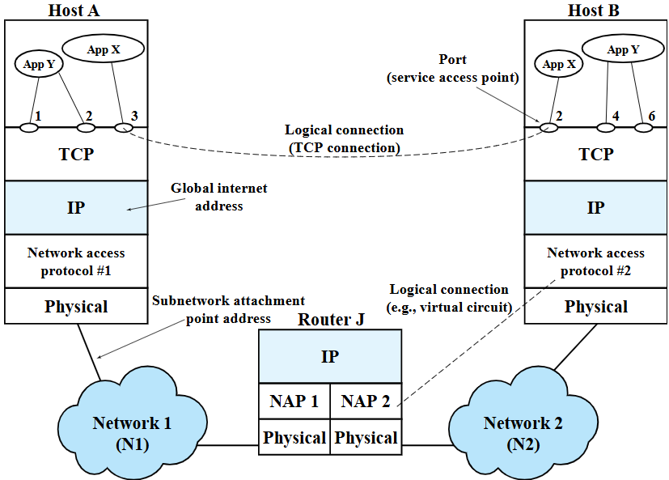

# Client-Sever Program

### This mini project is a simple program to facilitate communication between a client and a server in Python.

### Image from the book Data and Computer Communications by William Stallings.

### When the APPY of the Host A wants to send data to the APPY of the other Host B, the data will be transferred through the layers of the TCP/IP model because the Hosts are in different networks.  However, the details of the procedure are hidden from the the application layer. APPYs can directly send and receive data across the logical connection => the socket API! => a programming interface that connects the application layer to the transport layer and from there, the rest of the TCP/IP protocol stack.

## Transfer data across UDP Sockets:

* ### Sending Data : 
1. Create a UDP socket.
2. (Optional) Bind to the local IP address and UDP port that the socket should use. 
(If you don’t choose a port, the operating system will select a random large port number for you when you first try to send data.)
3. Send data, by specifying the data to send and the destination IP address and port.

* ### Receiving Data : 

1. Create a UDP socket.
2. Bind to the local IP address and UDP port that the socket should use.
3. Receive data from the socket buffer, where the operating system will have put any data that was passed up the network protocol stack for this UDP port.

## Transfer data across TCP Sockets:
TCP is a connection-oriented protocol => more steps (Connection establishment of the two endpoints, one node (server) is going to listen and other node (client) will start the connection, Closing the connection).

* ### Server should:

1. Create a TCP socket.
2. bind to the local IP address and TCP port.
3. listen for incoming connections on the socket.
4. Call accept => waiting until there is an incoming connection. 
5. Connection is initiated by the client => accept will spin off a new socket which will be used for the connection to this host.
The Server may connect to different client (One socket can generate many conn_socket)

* ### Client will then:

6. Create a TCP socket.
7. (Optional) The client may bind to the local IP address and TCP port. 
8. Call connect, specifying the destination IP address and port of the server. (sending the “three-way handshake” between client and server)
9. Connection establishment is complete => the client and server applications can send and receive data (+ other functions).
12. The client or server can use the shutdown socket API call to close the connection.

